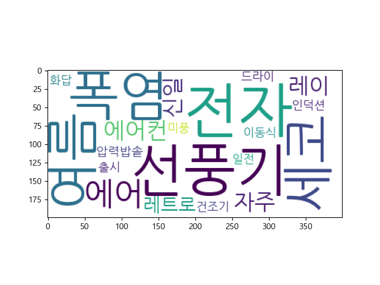
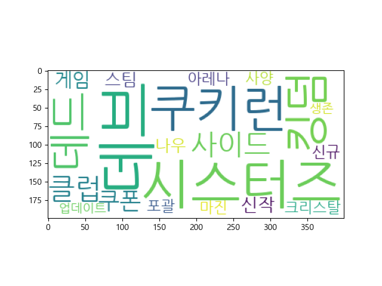

#Stock information with NLP

### '관련주'와 '재료'를 찾기위한 프로그램

### Summary

1. 크롤링 및 API를 사용하여 종목 데이터 가져오기
2. 자연어처리를 통해 각종 정보 제공

## result(main)

#### 1. Keyword to stocks

#### 2. relation stocks

#### 3. wordcloud

## Files Descriptions
### *1. stock_list.py*
+ 국내주식종목(코스피+코스닥)리스트 생성
### *2. crawling.py*
+ 종목 관련 글 크롤링
+ 타깃 종목들의 네이버 블로그, 카페, 뉴스 헤드라인을 크롤링하여 전처리 하여 stock_texts 파일로 저장
### *3. main.py*
+ 데이터 수집 완료 후 실행파일
+ 자연어처리
+ function

### *4.dart_api.py*
+ 금융감독원 전자공시 데이터 

### *4.word2vec.py*
+ word2vec을 시도했지만 성과 없음